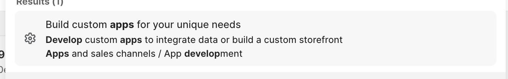

# Seeder Module

## What's Seeder?

Seeder lets you move data from simple JSON to Shopify or other setups. It's part of Next.js Enterprise Commerce. But remember, it's not for cloud or production - just local use.

**Only use Seeder locally. Keep it off cloud and production.**

## Setting Up

Before you start, shut down all Next.js Enterprise stuff on your machine.

### Setting environment variables

1. Go to `apps/seeder`.
2. Make a `.env` file there.
3. Put these in the file:
   ```
   SHOPIFY_ADMIN_ACCESS_TOKEN=
   SHOPIFY_STORE_DOMAIN=
   SEEDER_ENABLED=false
   ```

### Shopify Token

To set up a custom Shopify app for your store, hit `CMD` + `K` in Shopify's store admin and search for `develop apps`. Click on the  tab. You'll see your custom apps and a button to make a new one. Hit that button, name your app. This is where you get your admin access token. Remember, you might have to set up the token's scopes to read and write products and collections.

### Uploading Data

- Get your JSON data ready.
- Drop it in the `resources` folder in Seeder. Match the format of the examples there.

### Turning It On

- In `index.js` of Seeder, link up your data.
- Change `SEEDER_ENABLED` in `.env` to `true`.
- Run it:
  ```
  yarn dev
  ```
