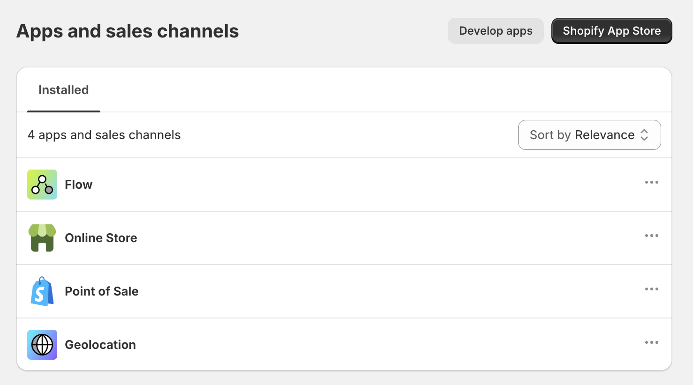
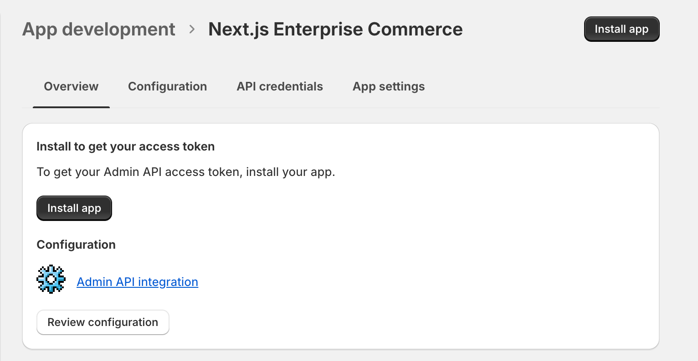

# Manual Setup

## Generating a Shopify Admin API Access Token

In Shopify, leveraging API capabilities becomes effortless through custom app creation within your store's admin interface. This approach is notably simpler compared to standard marketplace app development, primarily because it allows for straightforward generation of API Keys. These keys come with the added benefit of fine-tuned access control to specific scopes.

To embark on this process, navigate to the admin panel of your store, which can be accessed at `<your-store-url>/admin`. Once there, locate the `Apps` section in the left sidebar. Clicking on this will reveal a search menu, an unconventional yet functional design choice. Select the `App and sales channel settings` from this menu.

You'll be directed to the `Apps and sales channels` card, displaying all public apps installed in your store. To view or manage your private and custom apps, select the `Develop apps` button positioned at the page's top.

**Creating custom app**

Chances are, this list might be empty if you haven't created an app yet. So, let's proceed by clicking `Create an app`. For naming, you might consider `Next.js Enterprise Commerce`. Upon submission, your app should be operational.

**Seting up scopes**

The next crucial step involves generating the API Key. Navigate to the `API Credentials` tab and opt for the **`Admin API integration`** button. You should select the following scopes:

- `read_products`
- `write_products`
- `read_product_listings`
- `read_product_feeds`

Ensure you choose the latest API version, for instance, `2023-10`, and then save your settings.

**Accessing the Token**

Lastly, switch to the `Overview` tab and click on the `Install app` button. Post-installation, you'll receive an access token. It's vital to save this token securely as it cannot be retrieved once lost.

