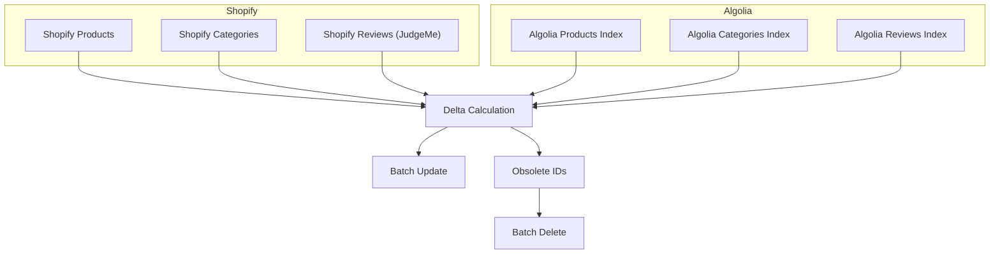

# Sync Script README

## Overview
This script synchronizes data from Shopify to Algolia in a reliable and idempotent way.

## Process
1. Fetch products and categories from Shopify
2. Fetch hierarchical collections
3. Optionally fetch reviews if enabled
4. Enrich products with hierarchical categories and reviews
5. Fetch current items from Algolia indices
6. Calculate delta (objects to update and obsolete objects to delete)
7. Batch update changed objects in Algolia
8. Batch delete obsolete objects in Algolia

## Delta Calculation
For each entity (products, categories, reviews):
- Map Algolia objects by `objectID`
- Compare Shopify data to Algolia data using deep equality (omit `objectID`)
- Items missing or changed are added to the update list
- Algolia objectIDs not present in Shopify IDs are considered obsolete

## Entities
- Products
- Categories
- Reviews (optional)

## Environment Variables
- `ALGOLIA_PRODUCTS_INDEX`
- `ALGOLIA_CATEGORIES_INDEX`
- `ALGOLIA_REVIEWS_INDEX`
- `SHOPIFY_HIERARCHICAL_NAV_HANDLE`

## Error Handling
- Top-level `try/catch` logs errors and exits with non-zero code
- Empty datasets are handled gracefully 